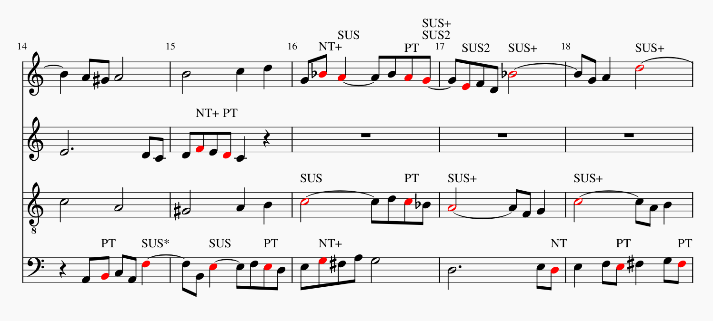

Dissonance Labelling
----------------

A MuseScore plugin that names the dissonances in common practice period counterpoint.

To install simply place the `dissonances.qml` in your MuseScore plugins folder. It works quite well on the likes of Palestrina, Pachelbel & Bach. But you will run into trouble with much earlier music (say Josquin de Prez) or much later music (Wagner). Each voice needs to be on its own staff, it will analyze anything selected. Contrapuntus I will take about 20 seconds, the whole Missa Papae by Palestrina will take 5 minutes. For big pieces or very strange situations it will crash MuseScore, be warned.

The code quality is not great, it's a quick and dirty port from python and there are some still needed features like multiple voices on a staff, any understanding of pedal tones and any understanding of compound lines. I think the basic concepts are pretty solid, but there is still much low hanging fruit to pick before this is a complete analysis tool.

Some of the labels for suspenses are quite specific
* SUS+ = delayed by 3th down into consonance step up resolving
* SUS* = delayed by a leap beyond 3th down into consonance leap up to expected resolving note
* SUS2 = delayed by 3th down into dissonance step up resolving
* SUS++ = delayed by leap down and multi-stepwise up to expected note

All of these expect the other voice to shut up until they reach their resolving note a step down from the suspense. I took the effort to have these labels to verify the pattern matching.

How does it work?
---------

It's pretty easy, there are 2 parts to my approach a pattern matching part in which you throw a dissonant note and its context and it will tell you with which pattern if any it can explain that dissonance, I do this for every dissonance both ways (A as dissonant relative to B & B as a dissonance relative to A, no assumptions). And the second part places all notes in a graph, connects the notes that are dissonant with each other and gives each edge two weights (one assuming one node is the Non-Chord-Tone the other assuming the other is the NCT) the weights (or really the complexity of the dissonance) are decided by the pattern matcher. Then we want to 'color' nodes so that:
1: each edge is connected to at least one colored node (otherwise there is an unexplained dissonance)
2: the total cost of all the weights corresponding with the colored nodes & their edges should be minimized.

Then we put the correct label over each of the colored nodes (or notes) and done.

On the pattern matching
-------------

Pairs of voices are evaluated, one is considered the 'dissonant' voice. Whenever the pitch of either voice changes that is an event. Relative to the dissonant voice the motion is considered, 0 = no motion (the other voice moved), 1 = stepwise motion, 2 = leaps.

The motion just before the dissonant is called the preparation, the motion just after the resolve. The motion vector looks like this also containing information of the motion between not adjacent notes:
preparation>diss, diss>resolve, approach>resolve,  resolve>resolve+1, diss>resolve+1,  resolve+1>resolve+2, resolve>resolve+2, diss > resolve+2, repeat last 3 ad infinitum

So a passing tone is 1,1,2 because the motion between the prep. and diss. must be stepwise, as must be the diss. to resolve. but the pre. to resolve must be a leap. (otherwise it would be a NT).

This model is nice because the first 3 values describe the 7 basic dissonances
* 1, 1,2 PT
* 1, 1,0 NT
* 0, 1,1 SUS/RET
* 1, 0,1 ANT
* 1, 2,1 ESC
* 2, 1,1 NT+ (a third + reversed step)
* 2, 1,2 APP

All other permutations are either clearly wrong (eg: 2, 2, 2) or logically impossible (eg: 1, 1, 1). And the extended motions can either be used to describe any delayed resolution or extended motion like the cambiata.

